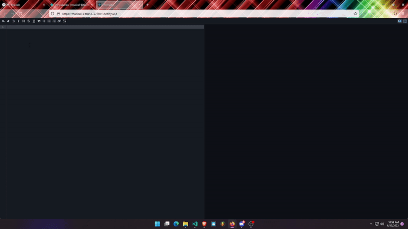

# Markdown Previewer
---
- A markdown previewer is a tool that allows a user to see how their markdown text will look once it is rendered. This is useful for previewing how a document will look before it is published, or for seeing how changes to a markdown document will look without having to actually render the document


### Technology used :

- React js
- ``` npx create-react-app markdown ```
### dependency :
```
- $ npm install @uiw/react-markdown-preview --save
```
### Run 
``` npm start ```
### Features : 
- Support dark-mode/night-mode. @v4
- GitHub style: The markdown content is rendered as close to the way it's rendered on GitHub as possible.
- Support GFM (autolink literals, footnotes, strikethrough, tables, tasklists).
- Support for defining styles via comment.
- Support for GFM footnotes.

[Available online](https://musical-kitsune-379bc1.netlify.app/)



---

#### Builds the app for production to the build folder.
```
- npm run build
```

The build is minified and the filenames include the hashes. Your app is ready to be deployed!

##### I deployed this project by [Netlify.com](https://www.netlify.com/)
